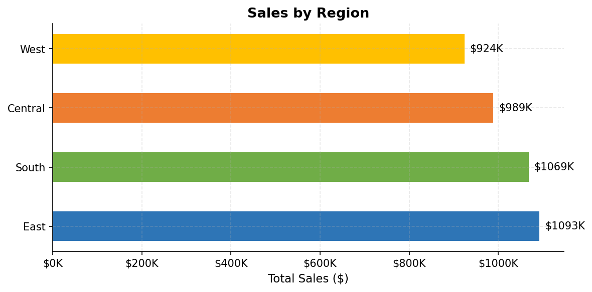
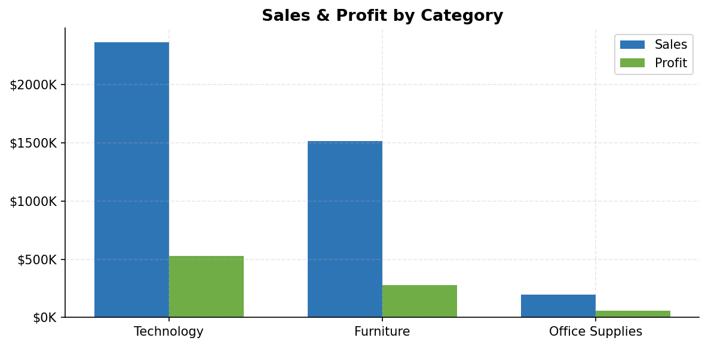
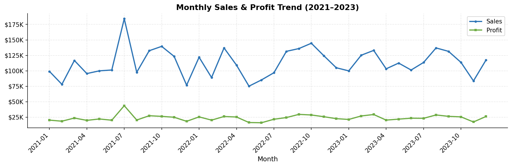
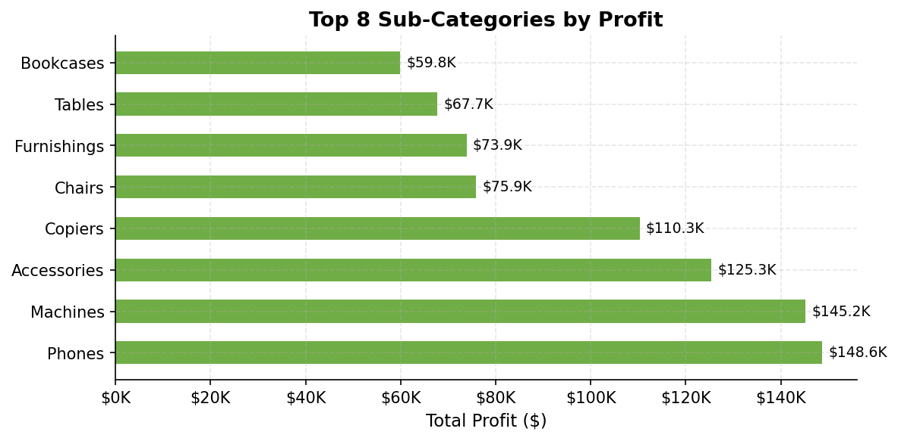
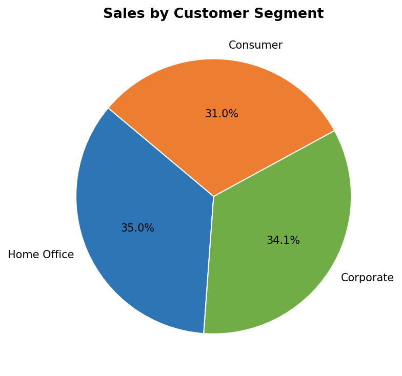
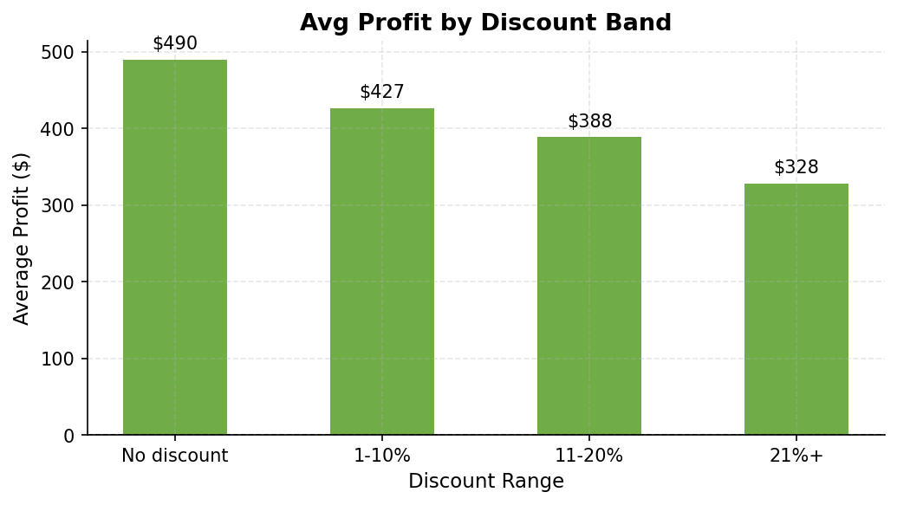
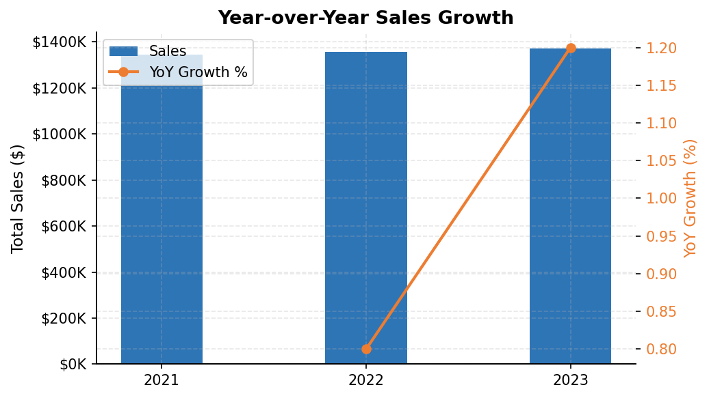

# Superstore Sales Analysis

**Tools:** Python · SQL (SQLite) · pandas · matplotlib · seaborn  
**Dataset:** 2,000 orders across 2021–2023 · 4 regions · 3 product categories  
**Author:** Jaya Mundre · [LinkedIn](#) · [Portfolio](#)

---

## Project Overview

End-to-end sales analysis of a retail superstore dataset using **SQL for data extraction** and **Python for visualization**. The goal was to uncover which regions, categories, and customer segments drive the most revenue and profit — and how discounting affects the bottom line.

---

## Key Findings

| Insight | Finding |
|---|---|
| Top region by sales | **East** — $1.09M (26.8% of total) |
| Most profitable category | **Technology** — $529K profit, 22.4% margin |
| Best customer segment | **Consumer** — highest total sales volume |
| Discount impact | Heavy discounts (21%+) cut avg profit by **33%** vs no discount |
| YoY growth | Steady growth: **+0.8%** (2022) → **+1.2%** (2023) |
| Fastest shipping | Same Day averages **1.2 days**; Standard Class averages **5.4 days** |

---

## Visualizations

### 1. Sales by Region

East leads all regions with $1.09M in sales. West is the lowest at $924K — potential growth opportunity.

### 2. Category Performance

Technology dominates both sales and profit. Office Supplies has the highest profit margin percentage despite lower absolute sales.

### 3. Monthly Sales Trend

Clear seasonality with peaks in Q4 each year. Profit tracks closely with sales, confirming stable margins over time.

### 4. Top Sub-Categories by Profit

Phones, Copiers, and Chairs lead profit generation. No sub-categories show negative profit — healthy product mix.

### 5. Sales by Customer Segment

Consumer segment accounts for ~50% of all sales. Corporate and Home Office are relatively balanced.

### 6. Discount Impact on Profit

**Key finding:** Every discount tier reduces average profit. Orders with no discount average $490 profit vs $328 for 21%+ discount bands. Over-discounting is a hidden margin leak.

### 7. Year-over-Year Growth

Consistent growth across all three years. Accelerating from 0.8% to 1.2% YoY growth suggests positive momentum.

---

## SQL Queries Covered

| Query | Business Question |
|---|---|
| Q1 | Overall KPIs — total orders, sales, profit, margin |
| Q2 | Sales & profit broken down by region |
| Q3 | Performance by product category |
| Q4 | Top 10 sub-categories by profit |
| Q5 | Monthly sales trend (2021–2023) |
| Q6 | Revenue by customer segment |
| Q7 | Shipping mode usage & average delivery time |
| Q8 | Top 10 states by sales |
| Q9 | How discounts affect average profit |
| Q10 | Year-over-year sales growth (with LAG window function) |

Full queries: [`sql/analysis_queries.sql`](sql/analysis_queries.sql)

---

## Project Structure

```
superstore-sales-analysis/
│
├── data/
│   ├── superstore.csv          # Main dataset (2,000 orders)
│   └── generate_data.py        # Script used to create dataset
│
├── sql/
│   └── analysis_queries.sql    # All 10 SQL queries with comments
│
├── outputs/
│   ├── 01_sales_by_region.png
│   ├── 02_category_performance.png
│   ├── 03_monthly_trend.png
│   ├── 04_subcat_profit.png
│   ├── 05_segment_pie.png
│   ├── 06_discount_impact.png
│   └── 07_yoy_growth.png
│
├── analysis.py                 # Main Python script (run this)
├── requirements.txt
└── README.md
```

---

## How to Run

```bash
# 1. Clone the repo
git clone https://github.com/YOUR_USERNAME/superstore-sales-analysis.git
cd superstore-sales-analysis

# 2. Install dependencies
pip install -r requirements.txt

# 3. Run the analysis
python analysis.py
```

All 7 charts will be saved to `outputs/`. Results are also printed to the terminal.

---

## Tech Stack

| Tool | Purpose |
|---|---|
| **Python 3.10+** | Core scripting |
| **pandas** | Data loading, cleaning, transformation |
| **SQLite (in-memory)** | SQL query execution |
| **matplotlib** | Chart generation |
| **seaborn** | Color palettes |

---

## What I Learned

- How to load CSV data into an in-memory SQLite database and run SQL directly from Python
- Writing window functions (`LAG`, `OVER`) for year-over-year comparisons
- Using `CASE WHEN` in SQL to create custom bucket segments (discount bands)
- Building multi-axis charts in matplotlib (bar + line overlay)
- Structuring a data project for GitHub with clear folder organization and a README

---

## Connect

- LinkedIn: [linkedin.com/in/jayamundre](#)
- Email: jassimundre99@gmail.com
- Next project: [Customer Churn Analysis](#)
